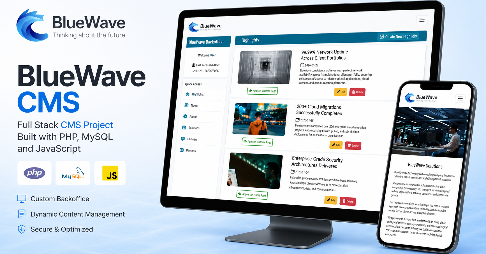
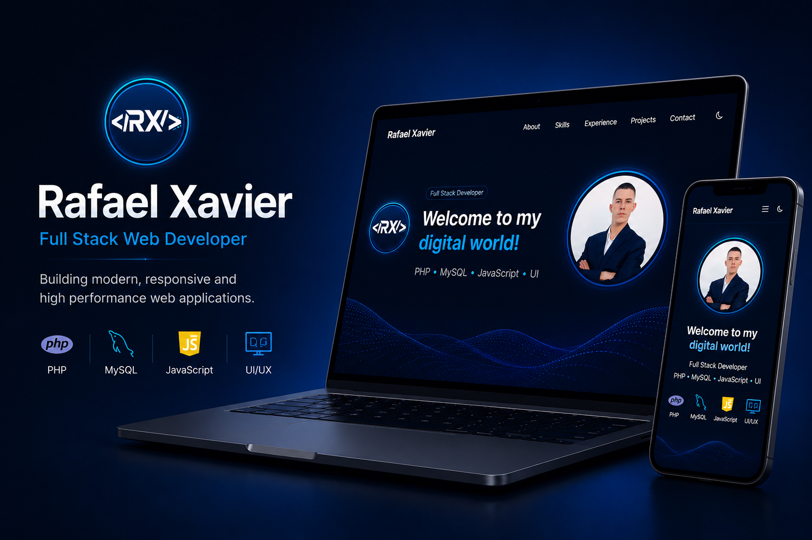

  

  <strong>Junior Full Stack Web Developer</strong>

  PHP • MySQL • JavaScript • WordPress • Deployment

---

# Hi, I'm Rafael Xavier 👋

Junior Full Stack Web Developer passionate about building responsive websites, custom CMS platforms and modern digital experiences.

## 🚀 Tech Stack

**Frontend**

* HTML
* CSS
* Bootstrap
* JavaScript

**Backend**

* PHP
* MySQL
* Python

**Tools & Platforms**

* Git & GitHub
* WordPress
* Elementor
* Hosting & Deployment

---

## 🌐 Featured Projects

### BlueWave CMS

  

Custom Full Stack CMS platform built with PHP, MySQL and JavaScript featuring authentication, CRUD operations, dynamic content management and a responsive admin dashboard.

🔗 **Live Demo**
https://bluewave.rafaelxavier.dev

🔗 **Repository**
https://github.com/pedro-rafael-xavier/bluewave

---

### Developer Portfolio

  

Responsive developer portfolio featuring dark/light mode, project showcases and live deployment.

🔗 **Live Website**
https://rafaelxavier.dev

🔗 **Repository**
https://github.com/pedro-rafael-xavier/portfolio

---

## 🎯 Currently

* Looking for my first opportunity as a Junior Web Developer
* Expanding my full stack development skills
* Building real-world projects and improving UI/UX

---

<h2 align="center">📫 Connect With Me</h2>

  

  

  

