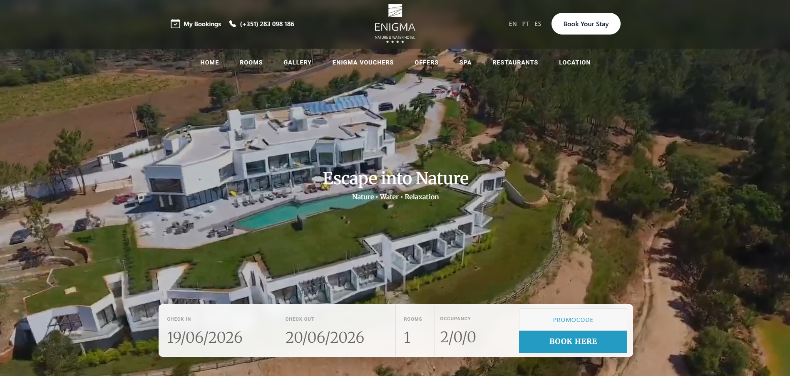
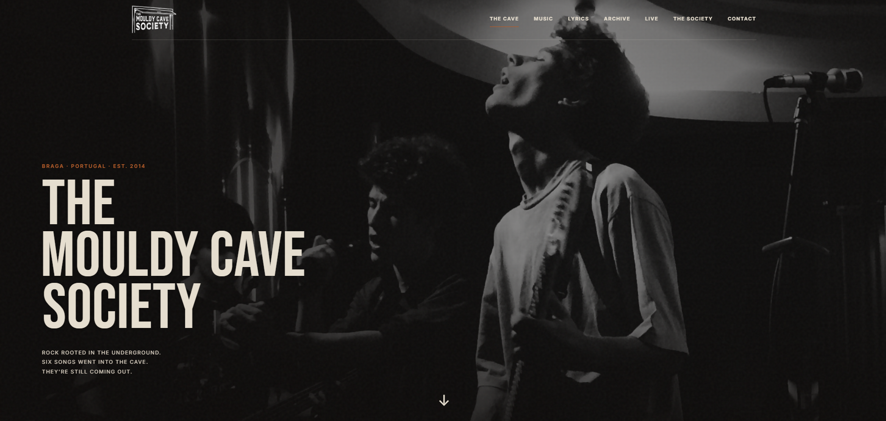

# Hi, I'm Rafael Xavier!

### Junior Full Stack Web Developer

PHP • MySQL • JavaScript • HTML • CSS • Bootstrap

Junior Full Stack Web Developer passionate about building responsive websites, custom CMS platforms and digital experiences.

I enjoy working across both frontend and backend development, with a particular interest in combining technology, design and creative projects.

---

## Tech Stack

**Frontend**

- HTML5
- CSS3
- Bootstrap
- JavaScript

**Backend**

- PHP
- MySQL
- Python

**Tools & Platforms**

- Git & GitHub
- WordPress
- Elementor
- Hosting & Deployment

---

## 🌐 Featured Projects

### BlueWave CMS

A custom Full Stack CMS platform built from scratch with PHP, MySQL and JavaScript.

The project includes authentication, database-driven content management, CRUD operations, image uploads, pagination, rich-text editing and a responsive administrative dashboard.

🔗 **Live Demo:** https://bluewave.rafaelxavier.dev

🔗 **Repository:** https://github.com/pedro-rafael-xavier/bluewave

---

### Enigma Nature & Water Hotel

Homepage redesign proposal developed as a technical assessment for the **Web Designer** recruitment process at Paraty Tech.

The project focused on visual design, usability, responsive development, performance and accessibility, translating a hotel homepage concept into a fully responsive web interface.

The implementation includes a promotional video hero, booking widget, hotel presentation, experiences, featured offers, trust indicators, newsletter section, interactive location map, mobile navigation and complete footer.

**Technologies:** HTML5, CSS3, Bootstrap 5, JavaScript and Bootstrap Icons.

**Lighthouse:** 100 Performance · 96 Accessibility · 100 Best Practices · 100 SEO

🔗 **Live Website:** https://enigma.rafaelxavier.dev

🔗 **Repository:** https://github.com/pedro-rafael-xavier/enigma-hotel

---

### The Mouldy Cave Society

Official website and digital archive for **The Mouldy Cave Society**, a rock band from Braga, Portugal.

The project was designed and developed as a custom online home for the band, combining editorial web design with music history, archival material and the band's underground rock identity.

The website includes music and release pages, a lyrics archive, historical archive, live archive, band biography and members, contact page, SEO and social metadata, custom 404 page, XML sitemap and `robots.txt`.

**Technologies:** PHP, HTML5, CSS3, JavaScript, Bootstrap and Apache.

**Lighthouse:** 99 Performance · 96 Accessibility · 100 Best Practices · 100 SEO

🔗 **Live Website:** https://themouldycavesociety.com/

🔗 **Repository:** https://github.com/pedro-rafael-xavier/the-mouldy-cave-society

---

### Developer Portfolio

Responsive developer portfolio featuring project showcases, modern interface design and live deployment.

🔗 **Live Website:** https://rafaelxavier.dev

🔗 **Repository:** https://github.com/pedro-rafael-xavier/portfolio

---

## Currently

- Looking for my first professional opportunity in software development
- Expanding my full stack development skills
- Building real-world projects
- Developing my frontend and UI/UX skills
- Exploring the intersection between technology and creative industries

---

## Connect With Me

